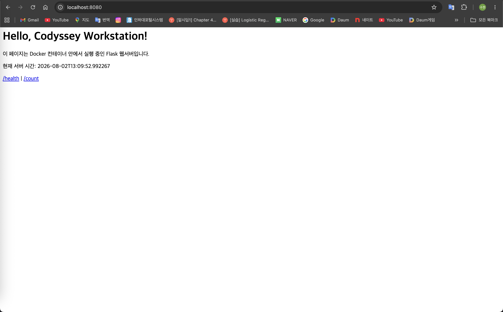
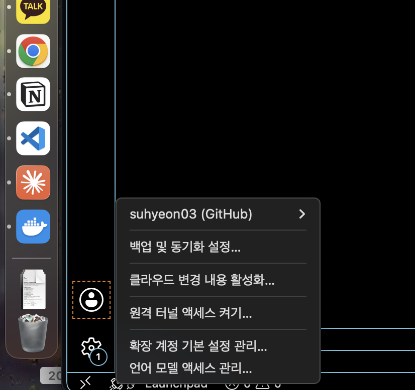

# 내 컴퓨터에 개발자용 '작업실' 꾸미기

> 실습을 진행하면서 아래 `_______` / `(붙여넣기)` 부분을 실제 명령어·출력·스크린샷으로 채우세요.
> 실습 순서와 명령어는 [GUIDE.md](./GUIDE.md) 참고.

## 1) 프로젝트 개요
로컬 개발 워크스테이션을 구축하는 미션. 리눅스 CLI(터미널), Docker(컨테이너),
Git/GitHub(버전관리·협업)를 사용해 "재현 가능한 실행 환경"을 만든다.
간단한 Flask 웹서버를 Dockerfile로 컨테이너화하고, 포트 매핑·바인드 마운트·볼륨으로
동작을 직접 검증한다.

## 2) 실행 환경
- OS: macOS 15.7.7 (Build 24G720)
- Shell: zsh
- 터미널: 기본 터미널
- 컨테이너 런타임: Docker Desktop (Context: desktop-linux)
- Docker: Docker version 29.6.1, build 8900f1d
- Git: git version 2.48.1

## 3) 수행 항목 체크리스트
- [x] 터미널 기본 조작 및 폴더 구성
- [x] 권한 변경 실습 (파일 1 + 디렉토리 1)
- [x] Docker 설치/점검 (`docker --version`, `docker info`)
- [x] hello-world / ubuntu 컨테이너 실행
- [x] Dockerfile 커스텀 이미지 빌드/실행
- [x] 포트 매핑 접속(2회)
- [x] 바인드 마운트 반영
- [x] 볼륨 영속성
- [x] Git 설정 + GitHub/VSCode 연동

---

## 4) 수행 로그 및 검증

### 4-1. 터미널 기본 조작
검증: 아래 명령으로 생성/복사/이동/삭제가 정상 동작함을 확인.
```bash
$ pwd
/tmp/demo
$ touch note.txt; echo "hello codyssey" > note.txt; cat note.txt
hello codyssey
$ cp note.txt note_copy.txt; mkdir backup; mv note_copy.txt backup/; mv note.txt memo.txt
$ ls -laR
total 8
drwxr-xr-x   4 suhyeon  wheel  128  8  2 22:24 .
drwxrwxrwt  28 root     wheel  896  8  2 22:24 ..
drwxr-xr-x   3 suhyeon  wheel   96  8  2 22:24 backup
-rw-r--r--   1 suhyeon  wheel   15  8  2 22:24 memo.txt

./backup:
-rw-r--r--  1 suhyeon  wheel   15  8  2 22:24 note_copy.txt
$ rm -r backup; ls -la
total 8
drwxr-xr-x   3 suhyeon  wheel   96  8  2 22:24 .
drwxrwxrwt  28 root     wheel  896  8  2 22:24 ..
-rw-r--r--   1 suhyeon  wheel   15  8  2 22:24 memo.txt
```
> **절대경로 vs 상대경로 설명**: 절대경로는 루트(`/`)부터 시작하는, 현재 위치와 무관하게 항상 같은 위치를 가리키는 경로다.
> 예) `/Users/suhyeon/codyssey/codyssey-workstation`. 상대경로는 현재 작업 위치(`pwd`)를 기준으로 한 경로다.
> 예) 현재 위치가 `~/codyssey`일 때 `codyssey-workstation`(하위 폴더), `./app`(현재 폴더의 app), `../`(상위 폴더).
> 같은 파일이라도 어디서 실행하느냐에 따라 상대경로는 달라지지만 절대경로는 항상 동일하다.

### 4-2. 권한 실습
검증: `chmod` 전/후 `ls -l` 비교.
```bash
$ touch perm_file.sh; mkdir perm_dir
# [변경 전]
$ ls -l perm_file.sh
-rw-r--r--  1 suhyeon  wheel  0  8  2 22:24 perm_file.sh
$ ls -ld perm_dir
drwxr-xr-x  2 suhyeon  wheel  64  8  2 22:24 perm_dir

$ chmod 755 perm_file.sh
$ chmod 700 perm_dir
# [변경 후]
$ ls -l perm_file.sh
-rwxr-xr-x  1 suhyeon  wheel  0  8  2 22:24 perm_file.sh   # 644 -> 755 (실행권한 x 추가)
$ ls -ld perm_dir
drwx------  2 suhyeon  wheel  64  8  2 22:24 perm_dir      # 755 -> 700 (소유자만 접근)
```
> **r/w/x 및 755·644 해석**: 권한은 소유자(user)·그룹(group)·기타(others) 3주체에 대해 각각 읽기 `r`(4)·쓰기 `w`(2)·실행 `x`(1)을 부여한다.
> 세 값을 더해 한 자리 숫자로 표기한다.
> - `755` = 소유자 `rwx`(4+2+1=7), 그룹 `r-x`(4+0+1=5), 기타 `r-x`(5). → 소유자는 전부 가능, 나머지는 읽기·실행만. 실행 파일/디렉토리에 흔히 사용.
> - `644` = 소유자 `rw-`(4+2=6), 그룹 `r--`(4), 기타 `r--`(4). → 소유자만 수정 가능, 나머지는 읽기만. 일반 문서 파일에 흔히 사용.
> - 디렉토리에서 `x`는 "그 안으로 들어갈(cd) 수 있는 권한"을 의미한다.

### 4-3. Docker 설치/점검
```bash
$ docker --version
Docker version 29.6.1, build 8900f1d

$ docker info | head -n 6
Client:
 Version:    29.6.1
 Context:    desktop-linux
 Debug Mode: false
 Plugins:
  buildx: Docker Buildx (Docker Inc.)
```
> `docker info`가 에러 없이 출력됨 → Docker 엔진(데몬)이 정상 동작 중.

### 4-4. 컨테이너 실행 실습
```bash
$ docker run hello-world
Unable to find image 'hello-world:latest' locally
latest: Pulling from library/hello-world
...
Hello from Docker!
This message shows that your installation appears to be working correctly.

$ docker run --rm ubuntu bash -c "ls /; echo inside-container"
bin  boot  dev  etc  home  lib  media  mnt  opt  proc  root
run  sbin  srv  sys  tmp  usr  var
inside-container

$ docker images
IMAGE                ID             DISK USAGE   CONTENT SIZE
codyssey-web:1.0     d53cfb09fc19        223MB         48.4MB
hello-world:latest   c3cbe1cc1aa5       22.6kB         10.3kB
ubuntu:latest        3131b4cc82a7        180MB         44.4MB
```
> **attach vs exec 차이 관찰**: `attach`는 컨테이너의 메인 프로세스(PID 1)에 다시 연결하는 것이라, 그 세션을 종료하면 메인 프로세스가 끝나 컨테이너도 멈춘다.
> `exec`는 실행 중인 컨테이너 안에서 **새 프로세스**(예: bash)를 띄우는 것이라, 그 셸에서 나와도(exit) 컨테이너의 메인 프로세스는 계속 살아있어 컨테이너가 유지된다.
> 그래서 실행 중인 컨테이너를 건드리며 점검할 때는 주로 `exec`를 쓴다.

### 4-5. Dockerfile 커스텀 이미지
- 선택한 베이스: `python:3.12-slim` (B안 — Linux 베이스 + 기능 추가)
- 커스텀 포인트:
  - `LABEL` 이미지 메타데이터 부여
  - `ENV PORT/DATA_DIR` 설정과 코드 분리
  - `HEALTHCHECK` 자가 상태 점검
  - `COPY app/` 애플리케이션 코드 주입
```bash
$ docker build -t codyssey-web:1.0 .
[+] Building ... FINISHED
 => naming to docker.io/library/codyssey-web:1.0

$ docker images | grep codyssey-web
codyssey-web:1.0     d53cfb09fc19        223MB         48.4MB
```

### 4-6. 포트 매핑 접속 증거 (2회)
```bash
$ docker run -d -p 8080:5000 --name web-8080 codyssey-web:1.0
$ docker run -d -p 8081:5000 --name web-8081 codyssey-web:1.0

$ curl http://localhost:8080
<h1>Hello, Codyssey Workstation!</h1><p>이 페이지는 Docker 컨테이너 안에서 실행 중인 Flask 웹서버입니다.</p><p>현재 서버 시간: 2026-08-02T13:24:57.308318</p>...

$ curl http://localhost:8081
<h1>Hello, Codyssey Workstation!</h1><p>이 페이지는 Docker 컨테이너 안에서 실행 중인 Flask 웹서버입니다.</p><p>현재 서버 시간: 2026-08-02T13:24:57.322798</p>...
```
> 같은 이미지를 8080·8081 두 포트로 동시에 실행 성공.
> 브라우저 접속 스크린샷(주소창 포함):
> 

> **포트 매핑이 필요한 이유**: 컨테이너는 호스트와 격리된 자체 네트워크 공간을 가진다. 그래서 컨테이너 내부에서 5000 포트로 서버가 떠 있어도
> 호스트(내 Mac)에서는 그 포트에 바로 접근할 수 없다. `-p 8080:5000`처럼 호스트 포트와 컨테이너 포트를 연결(매핑)해야
> `http://localhost:8080` 요청이 컨테이너의 5000 포트로 전달된다. 매핑 포트를 8080/8081처럼 다르게 주면 같은 이미지를 여러 개 동시에 띄울 수도 있다.

### 4-7. 바인드 마운트 반영
```bash
$ echo "<h1>version 1</h1>" > public/index.html
$ docker run -d -p 8082:5000 -v "$(pwd)/public":/mnt --name bind-test codyssey-web:1.0

# [변경 전] 컨테이너 안에서 확인
$ docker exec bind-test cat /mnt/index.html
<h1>version 1</h1>

# 호스트에서 파일 수정
$ echo "<h1>version 2 (changed on host)</h1>" > public/index.html

# [변경 후] 재빌드 없이 컨테이너 안에도 즉시 반영됨
$ docker exec bind-test cat /mnt/index.html
<h1>version 2 (changed on host)</h1>
```
> 호스트 파일 변경이 이미지 재빌드 없이 컨테이너에 바로 반영됨을 확인.

### 4-8. 볼륨 영속성
```bash
$ docker volume create mydata
mydata
$ docker run -d -p 8099:5000 -v mydata:/data --name vol-test codyssey-web:1.0

# 접속하며 카운트를 볼륨의 /data/count.txt 에 기록
$ curl -s http://localhost:8099/count
{"count":1,"data_file":"/data/count.txt"}
$ curl -s http://localhost:8099/count
{"count":2,"data_file":"/data/count.txt"}
$ curl -s http://localhost:8099/count
{"count":3,"data_file":"/data/count.txt"}

# [삭제 전] 데이터 확인
$ docker exec vol-test cat /data/count.txt
3

# 컨테이너 완전 삭제 후, 같은 볼륨으로 새 컨테이너 실행
$ docker rm -f vol-test
$ docker run -d -p 8099:5000 -v mydata:/data --name vol-test2 codyssey-web:1.0

# [삭제 후] 데이터가 그대로 유지됨 → 볼륨 영속성 증명
$ docker exec vol-test2 cat /data/count.txt
3
```
> 컨테이너를 삭제(`rm -f`)했는데도 볼륨 `mydata`에 저장된 값(3)이 새 컨테이너에서 그대로 유지됨.
> **Docker 볼륨(영속 데이터) 설명**: 컨테이너 내부에 쓴 데이터는 컨테이너를 삭제하면 함께 사라진다(컨테이너는 일회용).
> 볼륨은 컨테이너와 수명이 분리된 별도의 저장 공간으로, Docker가 호스트에 관리한다. 컨테이너에 `-v mydata:/data`로 연결하면
> `/data`에 쓴 내용이 볼륨에 저장되고, 컨테이너를 지운 뒤 같은 볼륨을 새 컨테이너에 다시 연결하면 데이터가 그대로 남아있다.
> 그래서 DB 데이터처럼 유지되어야 하는 데이터는 볼륨에 저장한다.
> (참고: 바인드 마운트는 "호스트의 특정 경로"를 직접 연결하는 방식이라 개발 중 코드/콘텐츠 즉시 반영에 유용하고, 볼륨은 Docker가 관리하는 저장소라 데이터 영속·이식성에 유리하다.)

### 4-9. Git 설정 + GitHub 연동
```bash
$ git config --list
user.name=suhyeon03
user.email=sjf****@naver.com          # 마스킹
init.defaultbranch=main
branch.main.remote=origin
branch.main.merge=refs/heads/main
```
- 원격 저장소: https://github.com/suhyeon03/codyssey-workstation
```bash
$ git remote add origin https://github.com/suhyeon03/codyssey-workstation.git
$ git branch -M main
$ git push -u origin main
Enumerating objects: 12, done.
...
To https://github.com/suhyeon03/codyssey-workstation.git
 * [new branch]      main -> main
branch 'main' set up to track 'origin/main'.
```
> VSCode GitHub 로그인/연동 스크린샷:
> 

> **Git vs GitHub 역할 차이**: Git은 내 컴퓨터에서 소스코드의 변경 이력을 관리하는 로컬 버전관리 도구다(커밋, 브랜치 등).
> GitHub은 그 Git 저장소를 인터넷에 올려 백업·공유·협업할 수 있게 해주는 원격 호스팅 플랫폼이다.
> 즉 `git commit`은 내 로컬에 기록하는 것이고, `git push`로 GitHub의 원격 저장소에 올려야 다른 사람이 보고 함께 작업할 수 있다.

---

## 5) 트러블슈팅 (2건 이상)

### 트러블슈팅 1: `docker build` 시 Dockerfile을 찾지 못함
- 문제: `docker build -t codyssey-web:1.0 .` 실행 시 `failed to read dockerfile: open Dockerfile: no such file or directory` 에러 발생.
- 원인 가설: 빌드 명령의 `.`(현재 디렉토리)에 Dockerfile이 없다. 즉 프로젝트 폴더가 아닌 다른 위치에서 명령을 실행했다.
- 확인: `pwd`로 현재 위치를, `ls -la`로 폴더 내용을 확인 → Dockerfile이 목록에 없음. `find ~ -name "Dockerfile" -path "*codyssey*"`로 실제 위치를 찾음.
- 해결/대안: Dockerfile이 있는 폴더로 `cd` 후 다시 빌드하여 성공. 경로에 공백(`Application Support`)이 있을 경우 경로 전체를 큰따옴표로 감싸야 한다.

### 트러블슈팅 2: 폴더 복사 시 파일이 중복 생성됨
- 문제: 프로젝트를 `~/codyssey`로 옮기는 과정에서 프로젝트 파일이 낱개(app, Dockerfile, README.md 등)로도 풀리고, `codyssey-workstation` 폴더로도 복사되어 중복됨.
- 원인 가설: `cp -R 원본 대상/`(폴더째 복사)과 `cp -R 원본/. 대상/`(내용물만 복사) 두 명령의 결과 차이를 혼동해 둘 다 실행함.
- 확인: `ls`로 `~/codyssey`에 낱개 파일과 `codyssey-workstation` 폴더가 함께 존재함을 확인.
- 해결/대안: `~/codyssey`에 있는 것이 맞는지 `pwd`로 먼저 확인한 뒤, 낱개로 풀린 중복 파일만 `rm -rf`로 삭제하여 `codyssey-workstation` 폴더 하나로 정리함. (`rm -rf`는 되돌릴 수 없으므로 실행 위치 확인이 필수.)

### 트러블슈팅 3: 볼륨 테스트에서 `/count`가 계속 404
- 문제: `curl http://localhost:8099/count`가 반복적으로 404를 반환하고 `count.txt`도 생성되지 않음. (`/`는 정상)
- 원인 가설: (1) 이미지에 라우트 누락, (2) 포트 점유 충돌, (3) 요청 URL 자체가 잘못됨.
- 확인:
  - `docker run --rm codyssey-web:1.0 python -c "import app; print(list(app.app.url_map.iter_rules()))"` → `/count`가 정상 등록됨(라우트 문제 아님).
  - `docker exec`로 컨테이너 내부에서 직접 호출 → `{"count":..}` 정상 응답(이미지 문제 아님).
  - 붙여넣은 명령을 다시 보니 `curl ... /count\; echo` 로, `; echo`의 세미콜론이 이스케이프되어 요청 URL이 `/count;`가 되어 있었음.
- 해결/대안: `curl`과 `; echo`를 한 줄에 두지 않고 **명령을 한 줄에 하나씩** 실행하니 `/count`가 정상 응답(1→2→3). 결론: 코드·이미지·볼륨 모두 정상이었고, 터미널 붙여넣기 시 세미콜론 이스케이프가 원인이었다.

---

## 6) 보안 확인
- [x] 로그/스크린샷에 토큰·비밀번호·개인키·인증코드 없음(git 이메일 마스킹 완료)
- [x] `.env`, `*.key`, `id_rsa` 등은 `.gitignore`로 제외됨
