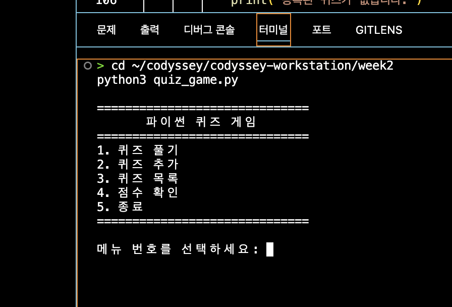
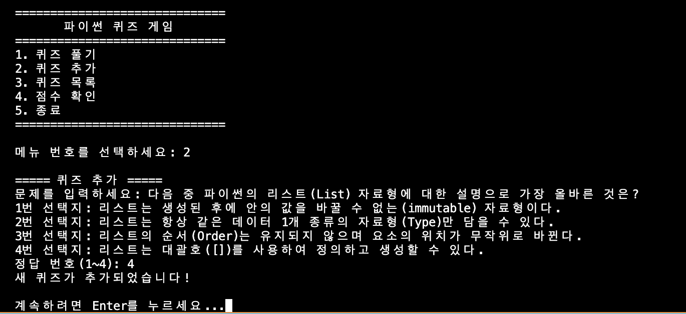
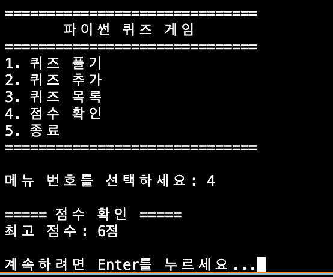
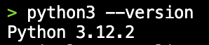
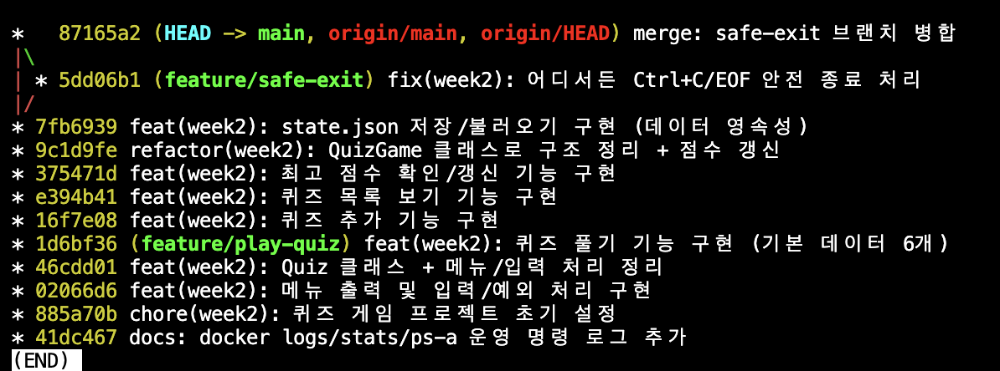

# week2 - 파이썬 퀴즈 게임

## 1. 프로젝트 개요
터미널에서 동작하는 파이썬 콘솔 퀴즈 게임입니다.
메뉴에서 번호를 선택해 퀴즈를 풀고, 새 퀴즈를 추가하고, 목록과 최고 점수를 확인할 수 있습니다.
객체지향(클래스)으로 코드를 구조화했고, JSON 파일 저장을 통해 프로그램을 종료해도
추가한 퀴즈와 최고 점수가 그대로 유지됩니다(데이터 영속성).

## 2. 퀴즈 주제와 선정 이유
- **주제: 파이썬 기초 & Git**
- **선정 이유:** 이번 과정에서 직접 배우고 있는 내용(변수·자료형·조건문·함수·클래스·파일입출력·Git 명령)을
  퀴즈로 만들면 스스로 복습할 수 있기 때문입니다. 문제를 만들면서 한 번, 풀면서 또 한 번 개념을 익히게 됩니다.

## 3. 실행 방법
```bash
# 1) 저장소 클론 (또는 다운로드)
git clone https://github.com/suhyeon03/codyssey-workstation.git

# 2) week2 폴더로 이동
cd codyssey-workstation/week2

# 3) 실행 (파이썬 3 필요)
python3 quiz_game.py
```
실행하면 메뉴가 뜨고, 번호를 입력해 기능을 사용합니다. `5`를 누르면 종료됩니다.

## 4. 기능 목록
- **퀴즈 풀기(1):** 저장된 퀴즈를 순서대로 출제하고, 정답/오답을 알려준 뒤 최종 점수를 표시합니다. 최고 점수도 갱신합니다.
- **퀴즈 추가(2):** 문제·선택지 4개·정답 번호를 입력받아 새 퀴즈를 등록하고 파일에 저장합니다.
- **퀴즈 목록(3):** 저장된 모든 퀴즈의 문제를 번호와 함께 보여줍니다.
- **점수 확인(4):** 최고 점수를 보여줍니다. 아직 풀지 않았으면 안내합니다.
- **종료(5):** 데이터를 저장하고 프로그램을 종료합니다.
- **예외 처리:** 빈 입력·문자 입력·범위 밖 숫자는 안내 후 다시 입력받고, Ctrl+C(강제 종료)나 입력 종료(EOF)에도 안전하게 종료합니다. 저장 파일이 없거나 손상돼도 기본 퀴즈로 실행됩니다.

## 5. 파일 구조
```
week2/
├── quiz_game.py     # 메인 프로그램 (Quiz, QuizGame 클래스 + 실행)
├── README.md        # 프로젝트 설명 문서
└── state.json       # 퀴즈/점수 저장 파일 (실행 중 자동 생성, git 미포함)
```

주요 구성 요소:
- `Quiz` 클래스 — 퀴즈 한 개(문제·선택지·정답)와 출력/정답확인 기능
- `QuizGame` 클래스 — 게임 전체 관리(퀴즈 목록·최고 점수 + 메뉴/풀기/추가/목록/점수/저장·불러오기)
- `get_default_quizzes()` — 저장 파일이 없을 때 쓰는 기본 퀴즈 6개
- `read_input()` — 안전한 숫자 입력(공통 예외 처리)

## 6. 데이터 파일 설명 (state.json)
- **경로:** 프로젝트 루트(`week2/state.json`)
- **역할:** 퀴즈 목록과 최고 점수를 저장/불러와, 프로그램을 껐다 켜도 데이터가 유지되게 합니다.
- **인코딩:** UTF-8 (한글 저장)
- **생성 시점:** 첫 실행 시에는 없으며, 퀴즈를 추가하거나 풀면 자동 생성됩니다. 없으면 기본 퀴즈로 시작하고, 손상되면 안내 후 기본 퀴즈로 복구합니다.
- **스키마 예시:**
```json
{
  "quizzes": [
    {
      "question": "파이썬에서 리스트를 만들 때 쓰는 기호는?",
      "choices": ["( )", "[ ]", "{ }", "< >"],
      "answer": 2
    }
  ],
  "best_score": 5
}
```
  - `quizzes`: 퀴즈 목록 (각 항목은 question, choices(4개), answer(1~4) 을 가짐)
  - `best_score`: 최고 점수(맞힌 문제 수). 아직 풀지 않았으면 `null`

## 7. 실행 화면 스크린샷

### 메뉴


### 퀴즈 풀기


### 퀴즈 추가


### 점수 확인


### 개발 환경 / Git 로그


