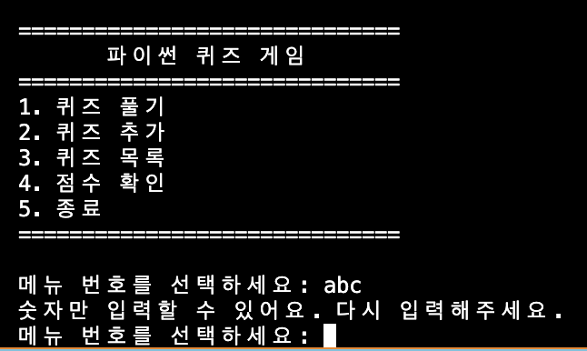
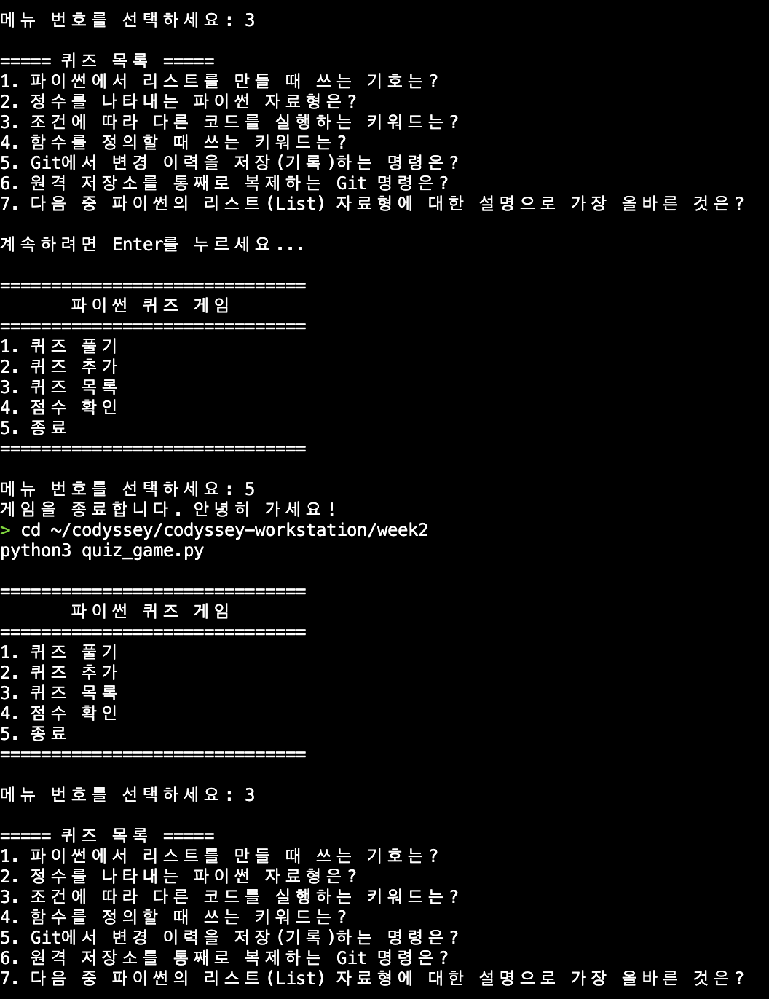

# week2 - 파이썬 퀴즈 게임

## 1. 프로젝트 개요
터미널에서 동작하는 파이썬 콘솔 퀴즈 게임입니다.
메뉴에서 번호를 선택해 퀴즈를 풀고, 새 퀴즈를 추가하고, 목록과 최고 점수를 확인할 수 있습니다.
객체지향(클래스)으로 코드를 구조화했고, JSON 파일 저장을 통해 프로그램을 종료해도
추가한 퀴즈와 최고 점수가 그대로 유지됩니다(데이터 영속성).

## 2. 퀴즈 주제와 선정 이유
- **주제: 파이썬 기초 & Git**
- **선정 이유:** 이번 과정에서 배우는 내용(변수·자료형·조건문·함수·클래스·파일입출력·Git)을
  퀴즈로 만들며 스스로 복습할 수 있기 때문입니다. 문제를 만들면서 한 번, 풀면서 또 한 번 익힙니다.

## 3. 실행 방법
```bash
git clone https://github.com/suhyeon03/codyssey-workstation.git
cd codyssey-workstation/week2
python3 quiz_game.py
```
메뉴에서 번호를 입력해 기능을 사용하고, `5`로 종료합니다.

## 4. 기능 목록
- **퀴즈 풀기(1):** 저장된 퀴즈를 출제하고 정답/오답을 알려준 뒤 최종 점수를 표시하며 최고 점수를 갱신합니다.
- **퀴즈 추가(2):** 문제·선택지 4개·정답 번호를 입력받아 등록하고 파일에 저장합니다.
- **퀴즈 목록(3):** 저장된 모든 퀴즈의 문제를 번호와 함께 보여줍니다.
- **점수 확인(4):** 최고 점수를 보여줍니다(미플레이 시 안내).
- **종료(5):** 데이터를 저장하고 종료합니다.
- **예외 처리:** 빈 입력·문자·범위 밖 숫자는 재입력, Ctrl+C/EOF에도 안전 종료, 파일 없음/손상 시 기본 퀴즈로 복구.

## 5. 파일 구조
```
week2/
├── quiz_game.py      # 메인 프로그램 (Quiz, QuizGame 클래스 + 실행)
├── README.md         # 프로젝트 설명 문서
├── docs/screenshots/ # 실행/개발환경/git 스크린샷
└── state.json        # 퀴즈/점수 저장 파일 (실행 중 자동 생성, git 미포함)
```

### 클래스별 책임과 주요 메서드
- **`Quiz`** — 퀴즈 한 개를 표현
  - `show()`: 문제와 선택지 출력
  - `is_correct(answer)`: 입력 번호가 정답인지 True/False 반환
- **`QuizGame`** — 게임 전체를 관리 (상태: `quizzes`, `best_score`)
  - `run()`: 메뉴 반복
  - `play_quiz()` / `add_quiz()` / `show_quiz_list()` / `show_score()`: 각 기능
  - `load_state()` / `save_state()`: 파일 불러오기/저장

## 6. 데이터 파일 설명 (state.json)
- **경로:** 프로젝트 루트(`week2/state.json`)
- **역할:** 퀴즈 목록과 최고 점수를 저장/불러와 프로그램을 껐다 켜도 데이터 유지
- **인코딩:** UTF-8 (한글 저장)
- **생성 시점:** 첫 실행엔 없고, 퀴즈 추가/풀기 시 자동 생성. 없으면 기본 퀴즈로 시작, 손상 시 안내 후 복구
- **필드 구조 예시:**
```json
{
  "quizzes": [
    {"question": "리스트 기호는?", "choices": ["( )", "[ ]", "{ }", "< >"], "answer": 2}
  ],
  "best_score": 5
}
```
  - `quizzes`: 퀴즈 목록 (각 항목: question, choices(4개), answer(1~4))
  - `best_score`: 최고 점수(맞힌 수). 미플레이 시 `null`

### 왜 JSON인가
JSON은 사람이 읽기 쉬운 텍스트 형식이라 저장된 데이터를 그대로 열어볼 수 있고(가독성),
별도 라이브러리 없이 파이썬 표준 `json` 모듈로 다룰 수 있어 가볍습니다(경량성).
파이썬의 리스트/딕셔너리 구조와 1:1로 대응돼 변환이 간단한 것도 장점입니다.

## 7. 설계 노트

### 클래스를 쓴 이유 (함수만 쓸 때와의 차이)
함수만 쓰면 `quizzes`, `best_score` 같은 상태를 함수마다 인자로 넘겨야 하고 데이터가 흩어집니다.
클래스를 쓰면 관련 **데이터(속성)와 기능(메서드)을 한 덩어리로 묶어(캡슐화)** 관리할 수 있습니다.
예: `QuizGame`이 `self.quizzes`를 들고 있어 `self.play_quiz()`처럼 인자 없이 자기 상태를 다룹니다.
`Quiz`(퀴즈 한 개)와 `QuizGame`(게임 전체)으로 역할을 나눠 코드가 읽기 쉽고 확장하기 좋아집니다.

### Git 브랜치 전략
- `main`은 항상 동작하는 안정 버전으로 유지합니다.
- 새 기능은 `feature/기능이름` 브랜치에서 개발합니다. (예: `feature/play-quiz`, `feature/safe-exit`)
- 완성 후 `git merge`로 `main`에 병합합니다. `--no-ff`로 병합해 병합 이력(merge commit)을 남겼습니다.
- **병합의 의미:** 팀 개발에서 각자 브랜치로 독립 작업하다 합치면, main을 망치지 않고 안전하게 기능을 통합할 수 있고 변경 검토(코드 리뷰)도 가능합니다.

### 커밋 컨벤션
작업(기능) 단위로 커밋하고, 메시지에 변경 요약을 담았습니다. 접두어 규칙:
- `feat:` 새 기능 / `fix:` 버그 수정 / `refactor:` 구조 개선 / `docs:` 문서 / `chore:` 설정
- 예: `feat(week2): 퀴즈 추가 기능 구현`, `fix(week2): Ctrl+C 안전 종료 처리`
- 총 10개 이상의 의미 있는 커밋과 브랜치 병합 기록은 아래 git 로그 스크린샷 참고.

### 데이터 백업/복구
- 저장 파일이 손상되면 안내 후 기본 퀴즈로 자동 복구합니다.
- 개선 방향: 저장 전 기존 파일을 `state.json.bak`으로 복사해두면, 손상 시 백업본으로 복원할 수 있습니다.

### 확장성 / 유지보수
- **대량 데이터(예: 퀴즈 1000개+):** 현재는 전체를 메모리에 올리고 매번 전체를 JSON으로 저장합니다.
  규모가 커지면 저장 비용·메모리 사용이 늘어나므로, 변경분만 저장하거나 SQLite 같은 DB, 인덱싱/스트리밍 도입을 고려할 수 있습니다.
- **요구 변경 시 수정 위치:** 점수 규칙 변경 → `QuizGame.play_quiz()`, 퀴즈 구조 변경(예: 난이도 추가) → `Quiz.__init__`과 저장/불러오기(`save_state`/`load_state`), 메뉴 변경 → `MENU`와 `QuizGame.run()`.

## 8. 실행 화면 스크린샷

### 메뉴


### 퀴즈 풀기


### 퀴즈 추가


### 점수 확인


### 잘못된 입력 처리


### 재시작 후 데이터 유지 (영속성)


### 개발 환경


### Git 커밋/브랜치 로그 (10+ 커밋, 병합 기록)


### git pull 실행

